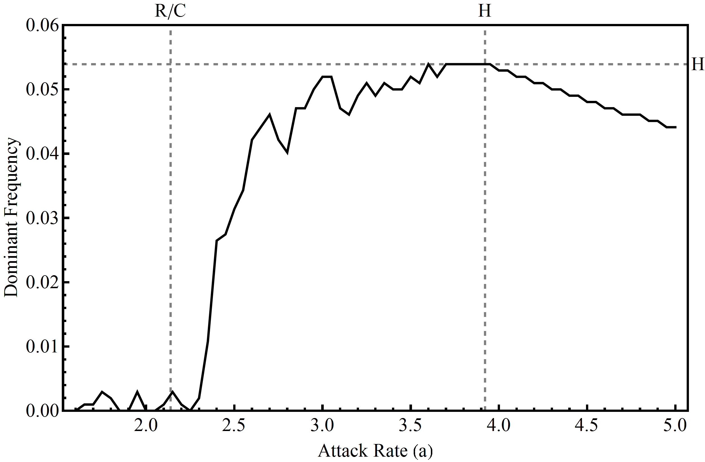

A recent lab paper by ex Ph.D. student (now PDF with Alan Hastings) Dr. Gabriel Gellner on how there exist two types of responses to increased energy flow in the basic C-R interaction. This duality in response (excitable and non-excitable dynamics) are then used to delineate two qualitatively different types of response to stochasticity. This work surprisingly suggests that the Lotka-volterra with "noise" tends to behave very similarly to the Rosenzweig-MacArthur in that a stochastic Hopf (sensu Arnold; Fig.) appears to occur at the point the C-R interaction goes from a maximum dominant eigenvalue that is real to one that is complex. This is the ecological equivalent of going from monotonic dynamic responses to perturbations to overshoot dynamics (R/C; Fig) familiar to many empirical population time series. [Click Dual Stability paper](https://doi.org/10.1007/s12080-016-0303-2).

