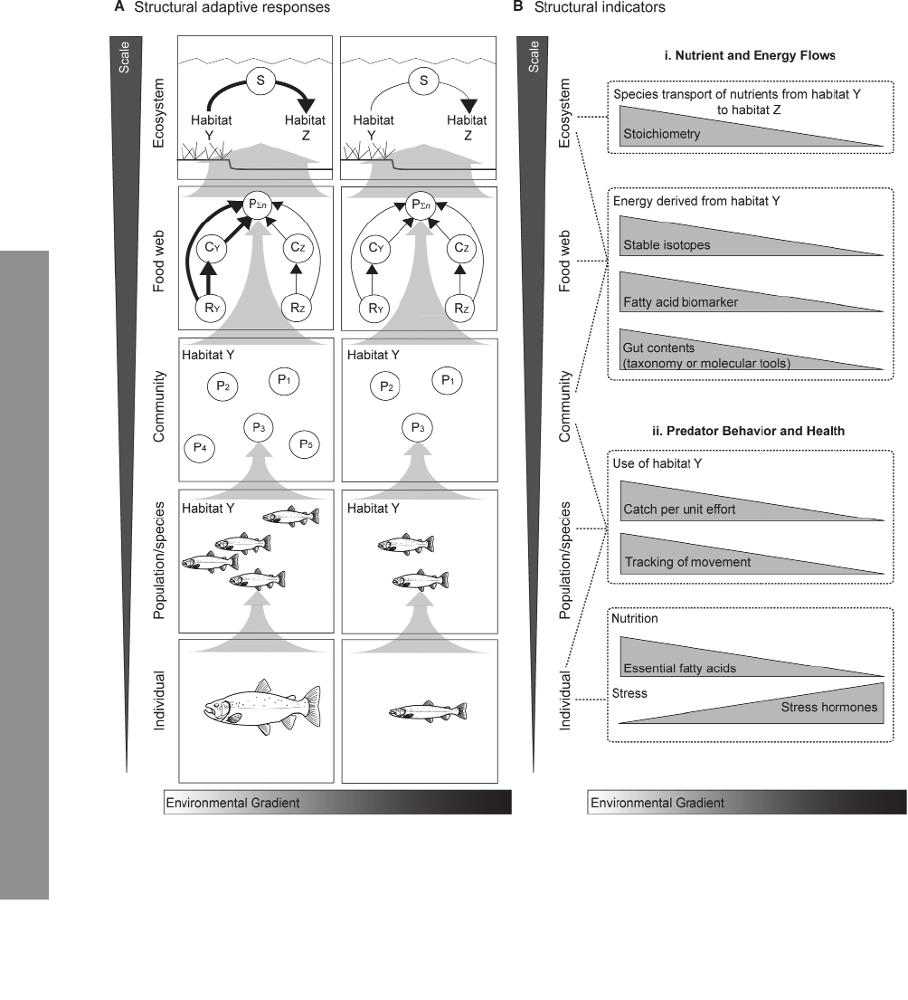

A recent article by Dr. Bailey McMeans and others argues that there is a consistent response of biodiversity to human impacts, from individual level attributes to whole ecosystems. This integration across scales, seldom considered in a discipline often separated by scales suggests that there exists an overarching framework for biomonitoring ecosystems under human impact. The paper is is published in [Ecological Monographs](https://esajournals.onlinelibrary.wiley.com/doi/full/10.1890/15-0288.1).

