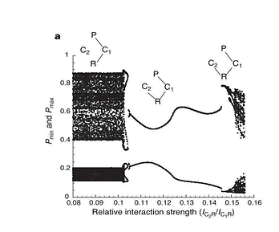

## General research

Generally speaking, we are interested in understanding how biological structure, broadly defined to include structure of all biological forms (i.e., spatial structure, food web structure, stage structure, variation in individuals), mitigates the stability and functioning of ecosystems. This question naturally leads to understanding how human impacts alter biological structure and so also how impacts may potentially alter the stability and functioning of whole ecosystems. This latter aspect of human impacts brings has our empirically motivated interests in developing practical biomonitoring techniques that span the ecological hierarchy.  Our work is theoretical, empirical and experimental and the lab takes students/researchers on all axes with one constraint, everyone must be interested in conceptual/theoretical development.

Ecology has long assumed the world is in equilibrium, in a sense, as a simplifying assumption. We have become interested in embracing variability, so to speak, and in doing so look at how variation -- especially known variation like massive cycles in pests or seasons -- alters biological structure consistently. The question then becomes: how this changing structure influence stability and ecosystem services?  Since human impacts like climate change are altering seasonal signals, for example, then these existing communities may expect to rapidly face changes in some of signals they have long adapted to. This latter area of research, in a sense, seeks to flesh out the “mechanisms” that make ecological systems “prototypical examples of complex adaptive ecosystems” (Simon Levin).

## :construction: WIP :construction:
